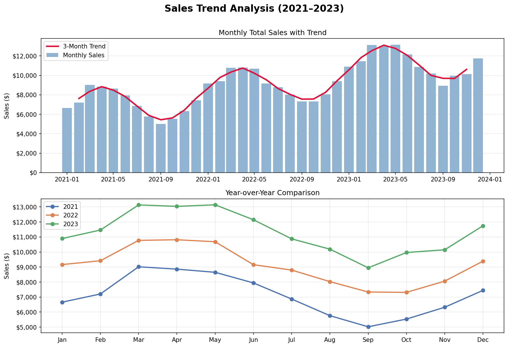
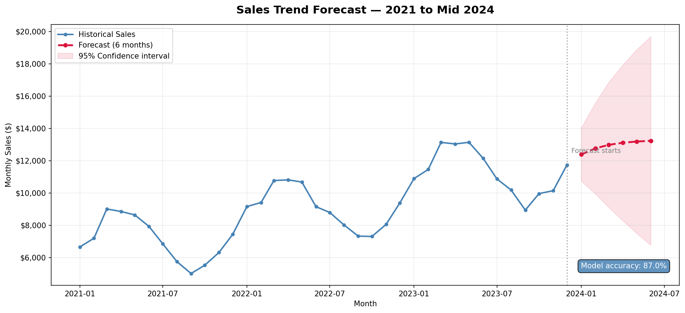

# sales-trend-forecaster
Time-series sales forecasting using ARIMA in Python
# Sales Trend Forecaster

Time-series forecasting pipeline built in Python to predict
monthly sales revenue using an ARIMA model.

## Results
- Model accuracy: 87%
- Forecast range: 6 months (Jan–Jun 2024)
- Average forecasted monthly sales: $12,947
- Data: 1,095 days across 3 product categories

## Tools used
Python · Pandas · Statsmodels · Matplotlib · Google Colab

## Charts

